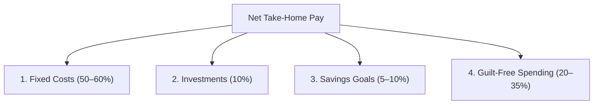

export const metadata = {
  title: "The Conscious Spending Plan: How to Spend Guilt-Free on What You Love",
  description:
    "Learn Ramit Sethi's 4-bucket Conscious Spending Plan from I Will Teach You to Be Rich. Stop cutting lattes and automate your savings and guilt-free spending.",
  date: "2026-08-16",
};

Traditional budgeting advice is built on deprivation. It tells you to stop buying $5 lattes, cancel every streaming subscription, and feel guilty every time you go out for dinner with friends.

In his bestselling book *I Will Teach You to Be Rich*, Ramit Sethi introduces a liberating counter-philosophy:

> *"Spend extravagantly on the things you love, and cut costs mercilessly on the things you don't."*

Instead of tracking 40 different line items and agonizing over pocket change, Sethi's **Conscious Spending Plan (CSP)** organizes your money into four automated buckets.

Here is how the system works and how to set it up in your own financial ledger.

---

## The 4 Buckets of a Conscious Spending Plan

The Conscious Spending Plan splits your **net take-home pay** across four distinct allocations:

### 1. Fixed Costs (50% to 60%)
These are the non-negotiable bills required to keep your life running:
- Rent or mortgage payments
- Groceries and basic household staples
- Utilities, internet, and phone bills
- Transportation, gas, and car insurance
- Minimum debt payments

> **Rule of thumb:** If your fixed costs exceed 60%, look for major structural wins (negotiating rent, refinancing loans, or cooking at home more often) rather than cutting minor pleasures.

---

### 2. Investments (10%)
This is your engine for long-term compound growth:
- Employer-matched 401(k) / Provident Fund contributions
- Low-cost broad-market index funds (e.g., S&P 500, Total Stock Market)
- Retirement accounts (Roth IRA, PPF, NPS)

This money is automated to leave your checking account within 24 hours of payday, so you never have the chance to spend it.

---

### 3. Savings Goals (5% to 10%)
Short- to medium-term savings for specific milestones:
- Building an emergency buffer (1–3 months of expenses)
- Vacation and travel funds
- Down payment for a home or wedding
- Large upcoming gifts or holiday expenses

Keeping these funds in dedicated high-yield accounts ensures you don't accidentally dip into them for daily spending.

---

### 4. Guilt-Free Spending (20% to 35%)
This is the most powerful part of the system. Once your Fixed Costs, Investments, and Savings Goals are funded, **everything remaining in this bucket is yours to spend without remorse**.

- High-end dining and weekend drinks
- Designer clothing or high-performance gear
- Concert tickets and spontaneous travel
- Upgraded hobbies and tech gadgets

Because your savings and bills are already handled automatically, you can spend this money down to $0 every single month with zero guilt.

---

## The $3 Questions vs. The $30,000 Questions

Most people spend 95% of their mental energy debating **$3 questions**:
- *"Should I buy the organic eggs or standard eggs?"*
- *"Can I afford this latte today?"*

Real financial freedom comes from getting the **$30,000 questions** right:
1. **Housing costs:** Keeping rent/mortgage well within your fixed cost bucket.
2. **Investment automation:** Investing 10%+ into index funds consistently for decades.
3. **Salary negotiation:** Earning 10% to 20% more at your job or building high-income skills.
4. **Eliminating high-interest debt:** Aggressively wiping out double-digit card balances.

Once you win the $30,000 battles, the $3 decisions take care of themselves.

---

## Conscious Spending Plan vs. The 50/30/20 Rule

How does the Conscious Spending Plan compare to other popular systems?

| Metric | Conscious Spending Plan (CSP) | 50/30/20 Rule |
| :--- | :--- | :--- |
| **Fixed Essentials** | 50% – 60% | 50% (Needs) |
| **Investing & Growth** | 10% (Explicit bucket) | Bundled into 20% |
| **Savings Goals** | 5% – 10% (Specific targets) | Bundled into 20% |
| **Guilt-Free Spending** | 20% – 35% | 30% (Wants) |
| **Core Philosophy** | Spend on what you love, cut the rest | Strict proportional division |

*(Calculate your target category figures using our [Interactive 50/30/20 Budget Calculator](/tools/50-30-20-calculator).)*

---

## How to Set Up Your Conscious Spending Plan in Pocketly

1. **Calculate your take-home pay** and define your 4 bucket targets.
2. **Create category groups in Pocketly** for *Fixed Costs*, *Investments*, *Savings*, and *Guilt-Free Spending*.
3. **Log transactions quickly** (learn [how to track expenses without spreadsheets](/blog/how-to-track-expenses-without-spreadsheets)).
4. **Conduct a monthly check-in** using our [20-Minute Monthly Money Review Checklist](/blog/how-to-conduct-a-monthly-money-review) to ensure your fixed costs stay under 60%.

When your money has clear boundaries, budgeting stops feeling like a punishment and starts feeling like permission to enjoy your life.
